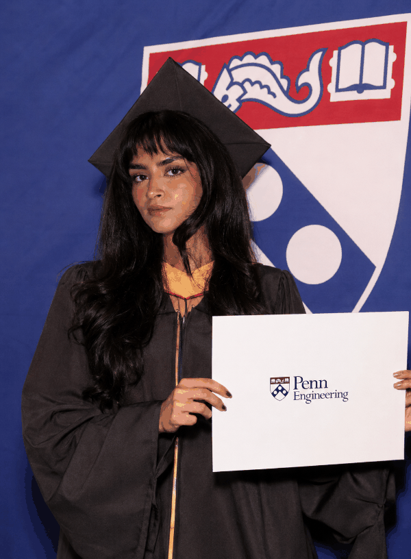

# ASCII Portrait — *Swathi Prakash*

An interactive, scroll-driven graduation portrait. It begins as raw `010101`
binary "typing" itself onto the screen, then evolves (through Python source,
the vocabulary of AI governance, and my own name) until it finally dissolves
into the real graduation photograph.

The characters that draw the portrait are pulled from the
things that made up the degree: the code, the research language, the name on
the diploma.

> **Live demo:** https://swathicrypto.github.io/ascii-portrait/

---

## The layers

As you scroll, the same portrait is redrawn from a different alphabet:

1. **Raw binary** : `010101…` the machine underneath
2. **Source code** : Python, how the models are built
3. **AI governance** : fairness, explainability, robustness, accountability, audit
4. **Name & degree** : `SWATHI PRAKASH · UPENN · PENN ENGINEERING · COMPUTER SCIENCE`
5. **Graduation** : the ASCII dissolves into the real photograph

## Interactions

- **Scroll** : moves through the five layers
- **Move the mouse** : left/right changes character density (chunky ↔ fine)
- **Click the portrait** : reveals / hides the real photo
- **Photo** : toggle between the three graduation portraits
- **Color** : switch between full color and black & white
- **Replay** : restart the typing intro

## The photos

Three portraits live in the repo as **`portrait1.png`**, **`portrait2.png`**,
and **`portrait3.png`** — the **◇ photo** button toggles between them, each shown
whole in its original orientation.

## Tech

Plain HTML5 Canvas + vanilla JavaScript. No dependencies, no framework.

---

*Built to mark graduating from the University of Pennsylvania.* 🎓
